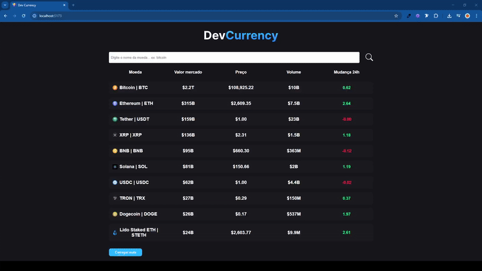
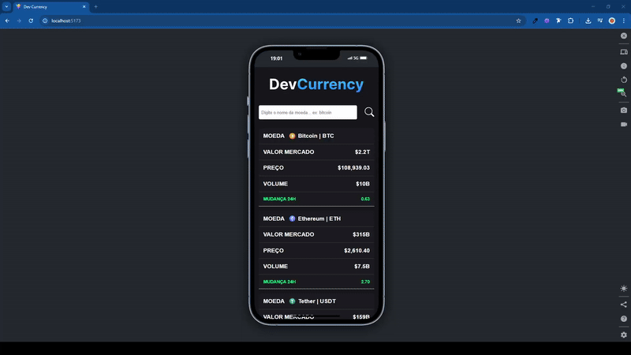
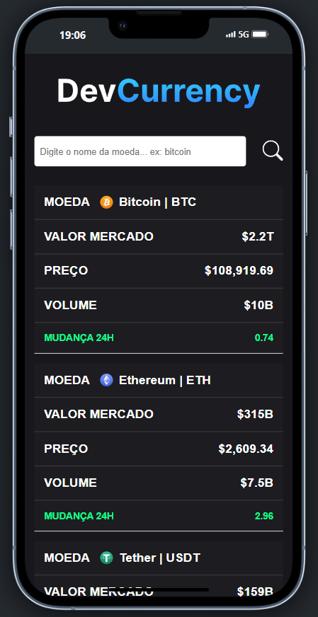
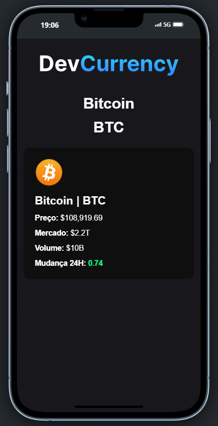
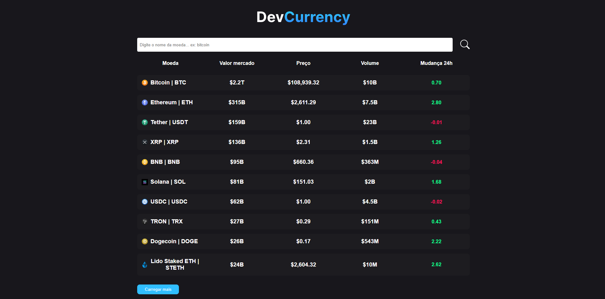
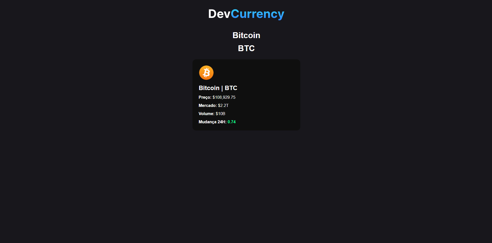

# DevControle




O **DevCurrency** é uma aplicação web de nível profissional desenvolvida para acompanhar em tempo real as métricas de diversas moedas virtuais de forma prática, dinâmica e visualmente agradável. Criado com _React e ModuleCSS_, o projeto faz consumo de APIs externas via fetch, exibindo informações atualizadas de cada criptomoeda em páginas dinâmicas, com rotas condicionais baseadas no ID da moeda.

## Sumário

1. [Visão Geral do Projeto](#visão-geral-do-projeto-funcionalidades-principais)
   - [Visualização única de varias moedas](#1-visualização-única-de-varias-moedas)
   - [Acesso para uma aba de detalhes de uma moeda em específico](#2-acesso-para-uma-aba-de-detalhes-de-uma-moeda-em-específico)
   - [Busca de moeda](#3-busca-de-moeda)
2. [Tecnologias Utilizadas](#tecnologias-utilizadas-linguagens-e-ferramentas)
3. [Estrutura do Projeto](#estrutura-do-projeto)
5. [Screenshots](#screenshots)
   - [Mobile](#mobile)
   - [Desktop](#desktop)
6. [Requisitos para Rodar o Projeto Localmente](#requisitos-para-rodar-o-projeto-localmente)
7. [Rodar o Projeto Localmente](#rodar-o-projeto-localmente)
8. [Autores](#autores)
9. [Licença](#licença)

## Visão Geral do Projeto (Funcionalidades Principais)

### 1. Visualização única de varias moedas:

- A visualização em scroll infinito das moedas com botão que chama mais dados.
- Acesso limitado ao 'ver mais' para podermos controlar a performance da página.

### 2. Acesso para uma aba de detalhes de uma moeda em específico:

Ao acessar uma moeda há uma aba com mais detalhes da moeda, com renderizaçãode uma página condicional, pois necessita lidar com dados via URL para a chamada de dados.

### 3. Busca de moeda:

Na página principal possui um input para fazer a pesquisa da moeda que desejar para ver seus detalhes aprofundados!

## Tecnologias Utilizadas (Linguagens e ferramentas)

<table>
    <tr>
      <td align="center">
        <a href="https://legacy.reactjs.org/">
          
          <br />
          <sub>
            <b>Next.JS</b>
          </sub>
        </a>
      </td>
      <td align="center">
        <a href="https://developer.mozilla.org/pt-BR/docs/Web/CSS">
          
          <br />
          <sub>
            <b>CSS3</b>
          </sub>
        </a>
      </td>
    </tr>
</table>
<table border-style="none">
  <tr>
    <td align="center">
      <a href="https://git-scm.com/">
        <br />
        <sub>
          <b>Git</b>
        </sub>
      </a>
    </td>
    <td align="center">
      <a href="https://github.com/">
        
        <br />
        <sub margin-top="50px;">
          <b>Github</b>
        </sub>
      </a>
    </td>
  </tr>
</table>

## Estrutura do Projeto

O projeto é organizado em vários arquivos para melhor organização do código e separação de interesses:

- `public/`: A pasta serve como o local para armazenar arquivos estáticos que não passam pelo processo de build do React e podem ser acessados diretamente no navegador.
- `src/`: Onde encontra-se o processo de desenvolvimento de todo o código-fonte do sistema.
- `src/pages/`: A pasta contém todo o sistema de rotas e páginas do projeto.
- `src/components/`: A pasta contém todos os componentes utilizados na aplicação.

## Screenshots

### Mobile




### Desktop




## Requisitos para Rodar o Projeto Localmente

### Node.js e npm:

- Verifique se você tem o Node.js instalado. Caso contrário, faça o download e instale a versão mais recente do Node.js.
- O npm (Node Package Manager) é instalado automaticamente com o Node.js.

### Git:

- Certifique-se de ter o Git instalado em sua máquina. Se não tiver, você pode baixá-lo aqui.

### Editor de Texto ou IDE:

- Escolha um editor de texto ou uma IDE (Ambiente de Desenvolvimento Integrado) para trabalhar no código. Alguns exemplos populares incluem o Visual Studio Code, Sublime Text e Atom.

### Navegador Web:

- Você precisará de um navegador web para visualizar o aplicativo localmente. Recomendamos o uso do Google Chrome, Mozilla Firefox ou Microsoft Edge.

### Configuração do CoinCap:

- Necessita realizar toda a configuração para utilização da API do CoinCap com sua chave de API.

## Rodar o Projeto Localmente

**Clone o projeto**

```bash
  git clone https://github.com/MarcioJorgeMelo/devCurrencyAPI.git
```

**Vá para a pasta do projeto**

```bash
  cd devcurrecny
```

**Abra o projeto no VSCode**

```bash
  code .
```

**Instale as dependências**

```bash
  npm install # Instala as dependências (se ainda não tiver feito)
```

**Abra com o React Server**

```bash
  npm run dev # Inicia o servidor ReactJS
```

## Autores

- [@MarcioJorgeMelo](https://github.com/MarcioJorgeMelo)

## Licença

- [MIT](https://choosealicense.com/licenses/mit/)
